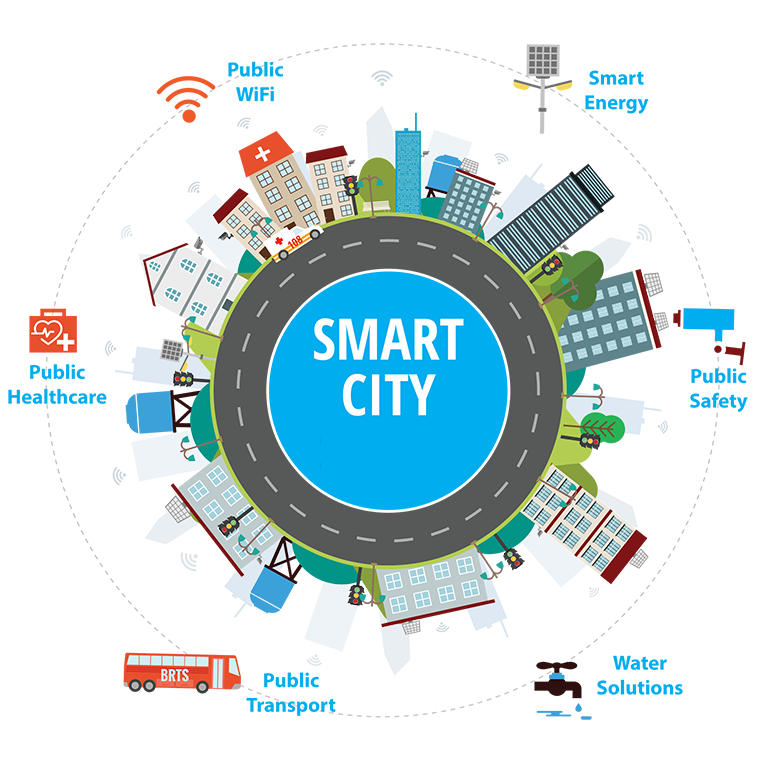
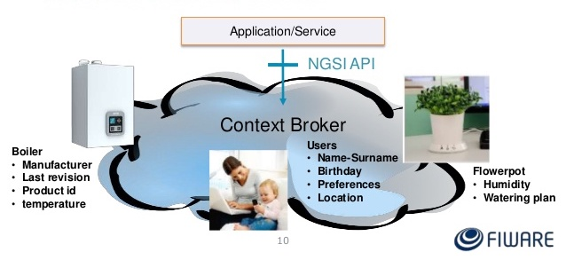
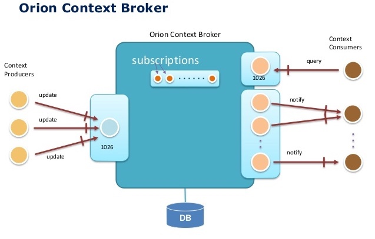

# Fiware
---
##Información de contexto
Es el valor de el atributo que caracteriza una entidad en una aplicación. Esta información providene de diferentes fuentes y protocolos.


-- 

## Modelo NSGI 
NSGI (Next Generation Service Interface Context Enabler) está basado en la definición de entidades y atributos. 

**Entidades** son una representación virtual de todos los objetos físicos en el mundo.

Cualquier información disponible sobre las entidades físicas expresadas en forma **atributos** de forma virtual.
## Orion Context Broker

Orion Context Broker (OCB) permite administrar todo el ciclo de vida completo de la información reelvante de acuerdo al ambiente. Estas facilidades van desde actualizaciones, consultas, registros y suscripciones. 

A través del OCB es posible registrar entidades de contexto y administrarlos a través de actualizaciones y consultas. Además, permite suscribirse a información de contexto para que cuando se produzca alguna condición (por ejemplo, un elemento de contexto se actualice) reciba una notificación. 

La siguiente figura muestra grosso modo el funcionamiento del OCB. Este es un intermediario entre los productores (dispositivos) y los consumidores (aplicaciones). 


* Los productores (estaciones) serán responsables de actualizar la información en la base de datos.
* Los consumidores realizarán consultas de acuerdo a las necesidades de las aplicaciones finales. Además de tener la posibilidad obtener noficaciones de una actualización particular. 

El formato de datos que utiliza el OCB es de tipo JSON
### JSON

El formato de datos JSON (Java Script Object Notation) es ligero para el intercambio de información, además es facil de leer así como de procesar.

El formato de JSON utilizado es una colección de nombres y valores. Esto en varios lenguajes se identifica como un objeto, estructura, registro, diccionario, tabla hash, etc.

```json
	{ "entidad": atributo, "entidad":atributo, ...}
```	
<!--
* Una lista ordenada de valores ya sea como un arreglo, vector, lista o una secuencia.

```
	{ atributo, atributo, ...}
```	-->
Un Objeto JSON tienen las siguiente forma:


Es decir, se encuentran definidos entre llaves. *String* será definido como las propiedades entidades. Los *value* son los atributos de tipo booleanos, otros objetos JSON, arreglos, números o nulo.

Ejemplo:

José tiene 30 años y cuenta con tres coches: VM, BMW y MB.

```json
	{ 
		"nombre":"José", 
		"edad":30, 
		"auto": 
		{
			"auto1":"VW",
			"auto2":"BMW",
			"auto3":"MB"
    	}
	}
```
No obstante, en Fiware, la API NGSI (*Next Generation Service Interface*) define:

- Un **modelo de datos** de información de contexto basado en la noción de *entidades de contexto*
- Una **interfaz de datos de contexto** (*context data interface*) para intercambiar información mediante operaciones de consulta, suscripción y actualización
- Una interfaz de disponibilidad de contexto (*context availability interface*) para intercambiar información sobre cómo obtener información de contexto.

<!--
Ejemplo de entidad de estacionamiento:

```json
	{
		"type": "ParkingSpot",
		"id": "lugar01",
		"name": "A-01",
		"floor": "Planta baja",
		"status": "free",
		"category": ["onstreet"],
		"refParkingSite": "Universidad:EstacionamientoAlumnos"
	}
```
* Type: Tipo de entidad que estamos almacenando en la BD.
* id: Identificador único del lugar.
* Status: occupied, free, closed, unknown.
* category: onstreet, offstreet.
*
Esta información JSON es almacenada en una base de datos. EL OCB es encargado de acceder a la información. Para ello se utiliza consultas de tipo RESTful
-->
### Consultas (RESTful)
OCB realiza consultas ("queries") a la base de datos que almacena en formato JSON. Las típicas consultas son insertar, actualizar, obtener borrar.
OCB contiene una interfaz tipo web para realizar dichas consultas, el cual es un servicio web tipo REST (Representational state transfer). 

La forma de interactuar con este tipo de servicios web es atraves de URL, tipo de acción y un cuerpo con información de tipo JSON.

Las operaciones comunes son:

- POST /v2/entitites
- GET /v2/entities 
- GET /vs/entities/{entityID}

Este tipo de servicios tiene la flexibilidad de obtener información de forma arborecente. Es decir, puedo obtener|actualizar|borrar información de una entidad completa o sólo valores de una entidad en especifico.

##### POST
Empecemos por crear un nuevo folder en Insomnia (llamémoslo, por ejemplo, Operaciones-comunes) e introducir ahí una nueva solicitud para subir una entidad.  Llamémosla *put-entity*.

Esta solicitud usará el comando POST. La estructura es:

```javascript
En el campo de URL se pone la dirección donde se encuentra el OCB
Content-type/json

Body:
{
		"id": "lugar01",
		"type": "ParkingSpot",
		"name" :{
			"value":"A-13"
	    },
		"floor" :{
			"value":"PB"
	    },
		"status" :{
			"value":"free"
	    },
		"category" :{
			"value":"onstreet"
		}
	}
```
Es muy importante que el **ID&Type** sea único. Es decir sólo puede exisitir un nombre de ID con un tipo de tipo, pero puede existir el mismo ID con distinto Tipo.

Para los campos de atributos, muchas veces se puede inferir el tipo a partir del valor, pero es una buena práctica incluir el tipo de dato (type).


##### GET
Hagamos una solicitud para leer las entidades.
Podemos duplicar la consulta anterior y renombrarla, por ejemplo, como *get-all-entitires*.  

Sólo se especifica el URL, sin body ni Content-type.  Por cierto, si se está consultando un OCB en la nube, se agrega en el campo X-Auth-Token el token que nos fue asignado:

```html
    get url   http://localhost:1026/v2/entities
	headers X-Auth-Token	1O11Qj4FReeHTs0Rb5hVLYwKNHFbbu
```

Para consultar una sola entidad, el URL se especifica con el ID:

```html
    http://localhost:1026/v2/entities/{id}
    #ejemplo
    http://localhost:1026/v2/entities/lugar01
```

(De paso, se puede observar que se agregó automáticamente un tipo para cada valor.  En nuestro ejemplo, se dedujo que era string.  En cambio, en metadata lo dejó vacío).

Para **borrar** una entidad, utilizamos el comando **Delete**:

```html
    delete url /entities/{id}
```

###Más operaciones
A partir de la versión 2 de NGSI es posible realizar operaciones con sólo un elemento ampliando el URL:

```
	get url /v2/entities/{entityID}/attrs/{attrName}
	put url /v2/entities/{entityID}/attrs/{attrName}
	delete url /v2/entities/{entityID}/attrs/{attrName}
	get url /v2/entities/{entityID}/attrs/{attrName}/value
	put url /v2/entities/{entityID}/attrs/{attrName}/value
```
### Actualización de valores

 Si queremos actualizar valores, sólo es necesario especificar en el URL de qué entidad se trata y en el Body mandar el JSON con valores correspondientes:

```json
http://localhost:1026/v2/entities/lugar01
Body:
{
    "name" :{
		"value":"A03"
    },
	"floor" :{
		"value":"Pb"
    },
	"status" :{
		"value":"occupied"
    },
	"category" :{
		"value":"offstreet"
    }
}
```


### Metadatos
Los metadatos se agregan en la nueva versión de NGSI. Simplemente se pone información adicional con la misma estructura.  Por ejemplo, si se está manejando temperatura, se podría agregar algo así:

	{
		"id":"lugar01",
		"type":"ParkingSpot",
		"temperature" :{
			"value":23,
			"metadata":{
				“precision”: {
    				“type”:xxx,
  					“value”: xxx
				}
			}
		...
<!--
**Ejercicio** 

1. Post. El ejercicio consiste en insertar una entidad tipo *lugar de estacionamiento* de acuerdo a la siguiente estructura:

```bash
	{
		"id": "lugar01",
		"type": "ParkingSpot",
		"name" :{
			"value":"A-13"
	    },
		"floor" :{
			"value":"PB"
	    },
		"status" :{
			"value":"free"
	    },
		"category" :{
			"value":"onstreet"
		}
	}
```

2. Gets:
	* Obtener toda la entidad
	* Obtener sólo los atributos
	* Obtener sólo el valor
3. Actualizar:
	* Atributo
	* Entidad
4. Borrar:
	* Un sólo atributo
	* la entidad
	* 
## Suscribir
-->

## OCB Query Language

Para practicar con algunos de los comandos de OCB, primero poblaremos la BD con varias entidades. Se pueden agregar las entidades una a una con el método POST, pero también es posible enviar un conjunto de entidades especificando un APPEND con el URL update, de lo contrario se tendrían que realizar post por cada entidad insertada.

```json
{
	"actionType":"APPEND",
	"entities":[
	{
		"id": "RH01",
		"type": "ParkingSpot",
		"name" :{
			"value":"A-01"
		},
		"floor" :{
			"value":"PB"
		},
		"status" :{
			"value":"free"
		},
		"location": {
    "type": "geo:point",
    "value": "19.345565, -99.201024"
		}
	},
	{
		"id": "RH02",
		"type": "ParkingSpot",
		"name" :{
			"value":"A-02"
		},
		"floor" :{
			"value":"PB"
		},
		"status" :{
			"value":"occupied"
		},
		"location": {
    "type": "geo:point",
    "value": "19.345808, -99.200724"
		}
	},
	{
		"id": "RH13",
		"type": "ParkingSpot",
		"name" :{
			"value":"A-11"
		},
		"floor" :{
			"value":"PA"
		},
		"status" :{
			"value":"free"
		},
		"location": {
    "type": "geo:point",
    "value": "19.345565, -99.201024"
		}
	},
	{
		"id": "MAR01",
		"type": "ParkingSpot",
		"name" :{
			"value":"A-01"
		},
		"floor" :{
			"value":"PB"
		},
		"status" :{
			"value":"closed"
		},
		"location": {
    "type": "geo:point",
    "value": "19.343472, -99.202255"
		}
	},
	{
		"id": "MAR02",
		"type": "ParkingSpot",
		"name" :{
			"value":"A-02"
		},
		"floor" :{
			"value":"PB"
		},
		"status" :{
			"value":"closed"
		},
		"location": {
    "type": "geo:point",
    "value": "19.343237, -99.202272"
		}
	},
	{
		"id": "MAR13",
		"type": "ParkingSpot",
		"name" :{
			"value":"B-13"
		},
		"floor" :{
			"value":"PA"
		},
		"status" :{
			"value":"unknown"
		},
		"location": {
    "type": "geo:point",
    "value": "19.344222, -99.201104"
		}
	},
	{
		"id": "ST01",
		"type": "ParkingSpot",
		"name" :{
			"value":"A-01"
		},
		"floor" :{
			"value":"PB"
		},
		"status" :{
			"value":"closed"
		},
		"location": {
    "type": "geo:point",
    "value": "19.311161, -99.223256"
		}
	},
	{
		"id": "ST02",
		"type": "ParkingSpot",
		"name" :{
			"value":"A-02"
		},
		"floor" :{
			"value":"PB"
		},
		"status" :{
			"value":"closed"
		},
		"location": {
    "type": "geo:point",
    "value": "19.311145, -99.223310"
		}
	},
	{
		"id": "ST13",
		"type": "ParkingSpot",
		"name" :{
			"value":"A-11"
		},
		"floor" :{
			"value":"PA"
		},
		"status" :{
			"value":"unknown"
		},
		"location": {
    "type": "geo:point",
    "value": "19.311161, -99.223256"
		}
	}
	]
}
```
(Nota: FIWARE ya tiene un conjunto de metamodelos estandarizados, para no inventar el hilo negro.
Buscar en Google FIWARE data models (**fiware.org/data-models**)
Otra página muy importante es **schema.org**)

Al realizar consultas, el OCB entrega únicamente 20 elementos por default. Si se desea traer más, se agrega el parámetro limit al query. (En insomnia, se tiene una ventana especial para agregar los parámetros del query).

	?limit=1

También se puede especificar el offset a partir del cual se leerán los valores.

	?oftset=5

Asimismo, si no deseamos recibir la información en formato NSGI, se puede especificar como opción keyValues como se muestra en el siguiente ejemplo:

	?options=keyValues  #quita el formato NSGI

Otro caso sería el obtener los lugares vacios, pero sólamente el nombre y el piso, y sin formato NSGI

	q			status==free
	attrs		name,floor
	options		keyValues
 
En los siguientes ejemplos se muestran consultas para un determinado tipo, para combinar varios identificadores, para elementos que coinciden con una expresión regular.

	?types=room
	idRooms1,Room2
	idPattern=^MAR[1][0-9]|RH[1][0-9]|ST[1][0-9]


## Datos geo-referenciados
Los datos anteriormente utilizados anteriormente cuentan con el atributo *location* el cual cuenta con la ubicación geográfica de lugares de estacionamiento en la ciudad de México.

Ahora vamos a buscar puntos dentro de una figura geométrica. Usaremos las API de la Versión 1, en la que se usan queries de contexto. Para especificar puntos fuera de una circunferencia, el método es POST y el body tiene lo siguiente:


```html
POST localhost:1026/v1/queryContext

{
    "entities": [
        {
            "type": "PointOfInterest",
            "isPattern": "true",
            "id": ".*"
        }
    ],
	"attributes":[
		"location","name"
	],
    "restriction": {
        "scopes": [
            {
                "type": "FIWARE::Location",
                "value": {
                    "circle": {
                        "centerLatitude": "19.435513",
                        "centerLongitude": "-99.141194",
                        "radius": "170",
						"inverted":"false"
                    }
                }
            }
        ]
    }
}
```

Se está buscando cualquier elemento (id *) de “ParkingSpot”. En la sección de atributos, recibiría todos; aquí se está indicando que sólo se quiere recuperar el nombre.  

Las restricciones para la búsqueda son un círculo con cierto centro y radio (en metros).  
Inverted: true significa que recupere todos los que no están dentro del círculo.

Ahora hagamos un query de un polígono, el cual se forma así:

```
{
	"entities": [
		{
			"type": "ParkingSpot",
			"isPattern": "true",
			"id": ".*"
		}
	],
	"attributes": [
		"location",
		"name"
	],
	"restriction": {
		"scopes": [
			{
				"type": "FIWARE::Location",
				"value": {
					"polygon": {
						"vertices": [
							{
								"latitude": "19.345085",
								"longitude": "-99.201305"
							},
							{
								"latitude": "19.344948",
								"longitude": "-99.200629"
							},
							{
								"latitude": "19.345975",
								"longitude": "-99.200575"
							},
							{
								"latitude": "19.346066",
								"longitude": "-99.201144"
							}
						],
						"inverted": "false"
					}
				}
			}
		]
	}
}
```
El polígono se forma por un conjunto de vértices.  La figura debe ser cerrada.

,